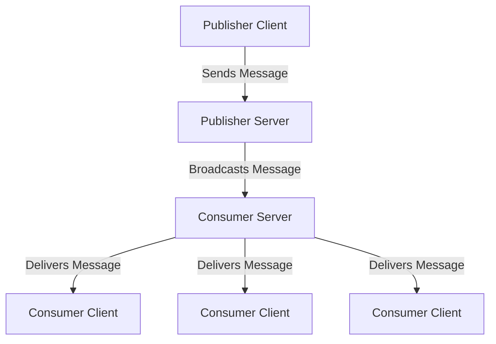

# WebSocket Server

This project contains two WebSocket servers: a publisher server and a consumer server. The publisher server receives messages from publishers and broadcasts them to all connected consumers, except the sender.

## Project Structure

```
websocket-server/
├── consumerServer.ts
├── publisherServer.ts
├── server.ts
├── utils.ts
├── .env
└── README.md
```

- `consumerServer.ts`: Contains the logic for the consumer WebSocket server.
- `publisherServer.ts`: Contains the logic for the publisher WebSocket server.
- `server.ts`: Entry point of the application that initializes both WebSocket servers.
- `utils.ts`: Utility functions for logging with timestamps.
- `.env`: Environment variables for configuration.
- `README.md`: This file.

## Project Graph



## Purpose

### Publisher Server

The publisher server listens on port 8081 and accepts connections from clients that want to send messages. When a message is received from a publisher, it is broadcast to all connected consumers, except the sender. This server is responsible for receiving and distributing messages to consumers.

### Consumer Server

The consumer server listens on port 8080 and accepts connections from clients that want to receive messages. When a message is received from a publisher, it is sent to all connected consumers. This server is responsible for handling incoming connections from consumers and delivering messages to them.

## Installation

1. Clone the repository:
   ```sh
   git clone https://github.com/yourusername/websocket-server.git
   cd websocket-server
   ```

2. Install dependencies:
   ```sh
   npm install
   ```

3. Create a `.env` file and set the ports:
   ```sh
   echo "CONSUMER_PORT=8080" > .env
   echo "PUBLISHER_PORT=8081" >> .env
   ```

## Usage

### Starting the Servers

Start the servers using the `start` script:
```sh
npm start
```

## Logging

Both servers log important events with timestamps, including connections, disconnections, messages received, and errors.

## Handling Process Termination

The servers handle the `SIGTERM` signal to gracefully shut down both the consumer and publisher servers.

## Changes

- The publisher server now ensures that the publisher client won't receive the message it sent.
- Updated log messages to accurately reflect the number of consumers that received the broadcasted message.

## Requirements

- Node.js version 14.x or higher

## License

This project is licensed under the MIT License.
